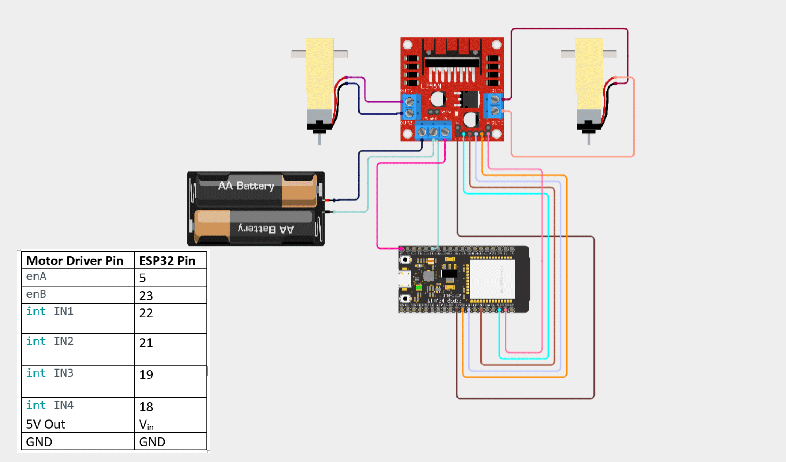
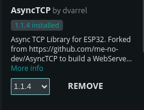
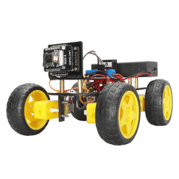

# Bluetooth and WiFi Car 2-in-1 🚗📶

A versatile ESP32-based car project that can be controlled over both **Bluetooth** and **WiFi**! Seamlessly switch between modes and enjoy flexible remote control capabilities.

---

## 🚦 Features

- Dual-mode control: Bluetooth & WiFi
- Easy setup with Arduino IDE
- Simple library and board manager integration
- Mobile and desktop browser support for WiFi mode

---

## 🛠️ Requirements

- **Arduino IDE:** `arduino-ide_2.3.6_Linux_64bit.AppImage` (Linux)
- **ESP32 Dev Board**

---

## 🔗 Board Manager Setup

For both Bluetooth and WiFi, add the following URLs to **Preferences > Additional Boards Manager URLs**:
1. [http://arduino.esp8266.com/stable/package_esp8266com_index.json](http://arduino.esp8266.com/stable/package_esp8266com_index.json)
2. [https://dl.espressif.com/dl/package_esp32_index.json](https://dl.espressif.com/dl/package_esp32_index.json)
3. [https://raw.githubusercontent.com/espressif/arduino-esp32/gh-pages/package_esp32_index.json](https://raw.githubusercontent.com/espressif/arduino-esp32/gh-pages/package_esp32_index.json)

---

## 🔵 ESP32 Car Using Bluetooth

- **Board Manager:** ESP32 by Espressif Systems (`3.2.1` for Bluetooth)
- **Library Manager:** No additional libraries required!

---

## 📶 ESP32 Car Using WiFi

- **Board Manager:** ESP32 by Espressif Systems (`2.0.11` for WiFi)
- **Connection:**  
  `station (mobile/desktop browser)` ⟷ `Access Point (ESP32 car)`

### Required Libraries

| Library | Link | Screenshot |
|---------|------|------------|
| **AsyncTCP** | [AsyncTCP GitHub](https://github.com/dvarrel/AsyncTCP) |  |
| **ESPAsyncWebServer** | [ESPAsyncWebServer GitHub](https://github.com/lacamera/ESPAsyncWebServer) |  |

---

## 📂 Arqui Project Explanation

---

## 🤝 Contributing

Contributions and suggestions are welcome! Please open an issue or pull request.

---

## 📜 License

This project is licensed under the MIT License.

---

TEAM MEMBERS

Fernando Enrique Llosa Manchego
Ronald reynaldo Valdez Aguero
Diego Josue Huaricallo Fano

---

> **Nachtlicht**: Turning night drives into a smart experience!
