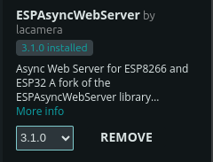

# Bluetooth and WiFi Car two in one
Bluetooth and WiFi Car 2 in 1

Requirements 

arduino-ide_2.3.6_Linux_64bit.AppImage <> linux 

esp32 car using bluetooth :

LIBRARY MANAGER
nothing else to do

BOARD MANAGER ESP32 by Espressif Systems
3.2.1 for bluetooth
preferences from file option -> Additional boards manager URLs:

http://arduino.esp8266.com/stable/package_esp8266com_index.json
https://dl.espressif.com/dl/package_esp32_index.json
https://raw.githubusercontent.com/espressif/arduino-esp32/gh-pages/package_esp32_index.json

esp32 car using wifi

station(mobile browser or desktop browser) <-----> Access Point(little remote control car)

LIBRARY MANAGER
AsyncTCP: https://github.com/dvarrel/AsyncTCP

ESPAsyncWebServer: https://github.com/lacamera/ESPAsyncWebServer

BOARD MANAGER ESP32 by Espressif Systems
2.0.11 for wifi
